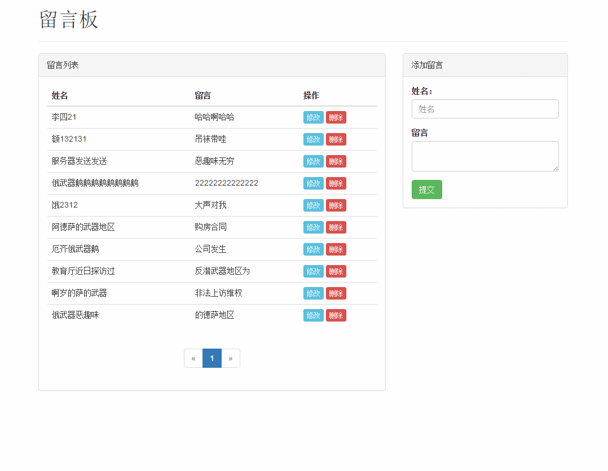

# nodejs和mongodb开发的一个简单留言板项目

### 1.nodejs和mongodb搭建的一个小相册。
1. 后端用了express、ejs模版引擎。了解了后端mvc结构的使用。
2. 前端用了jquery、bootstrsp构成。
3. 使用nodejs操作mongodb的增删改查。
### 2.项目结构
|__controller     //控制器        
|__model        //模型  
|__public         //静态资源  
|__views          //视图  
|__server.js         //入口文件  
|__package.json   //依赖
 
### 3.项目运行  
1. git clone git@github.com:luoanyang/messageBoard-nodejs.git
2. cd littleAblum-nodejs
3. npm install
4. node server.js
5. 浏览器打开 localhost (端口为80)

### 4.项目演示

